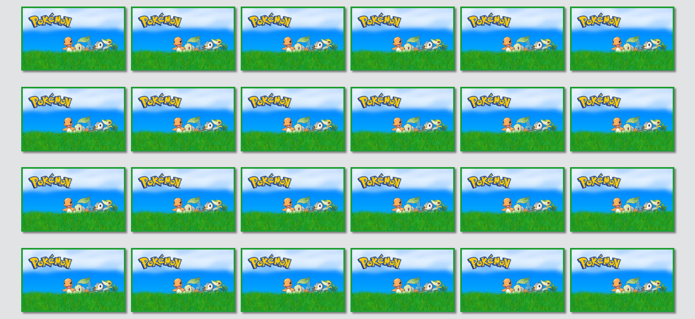

<h1 align="center">Jogo da memória: Pokémons Iniciais</h1>

    :loudspeaker:  Projeto Finalizado  :loudspeaker:

### Tópicos:

- [Descrição do projeto](#descrição-do-projeto)

- [Conhecimentos Explorados](#conhecimentos-explorados)

- [Ferramentas utilizadas](#ferramentas-utilizadas)

- [Acesso ao projeto](#acesso-ao-projeto)

## Descrição do projeto 

  O projeto consiste em um jogo da memória com a temática de pokémons iniciais do desenho Pokémon. Ao acessar à página, o usuário encontrará uma página de login, na qual poderá escolher entre começar o jogo ou verificar as regras.
  Ao clicar no botão de jogar, o usuário será direcionado para uma página com 24 cartas. Ao clicar em uma delas, a carta irá mostrar a imagem do pokémon. No segundo o clique, o jogador deverá tentar encontrar outra carta que contenha o mesmo pokémon clicado anteriormente, para formar um par. Quando o jogador formar 12 pares, vencerá o jogo!

  

## Conhecimentos Explorados

O principal objetivo do projeto é desenvolver novos conhecimentos de programação, além de rever outros aprendizados, explorando conceitos como:  
  ✓ Integração com uma API;  
  ✓ Conhecimentos de animação no CSS;  
  ✓ Funções assíncronas e parâmetros no JavaScript;  
  ✓ Manipulação do DOM, utilizando as propriedades que o Javascript fornece;  
  ✓ Criação de Popups integrando CSS e Javascript;  
  ✓ Uso de padrões organizacionais nos arquivos, facilitando a manutenção do código.  

## Ferramentas Utilizadas

Editor de código: Visual Studio Code.

Tecnologias: HTML5, CSS3 E JavaScript.

## Acesso ao projeto

Para acessar ao projeto, clique neste link: :paperclip: https://arthursilva5.github.io/memory-game-pokemon/ :paperclip:

Obrigado pela atenção!

